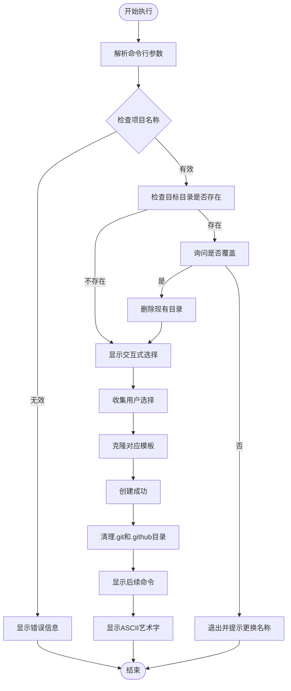
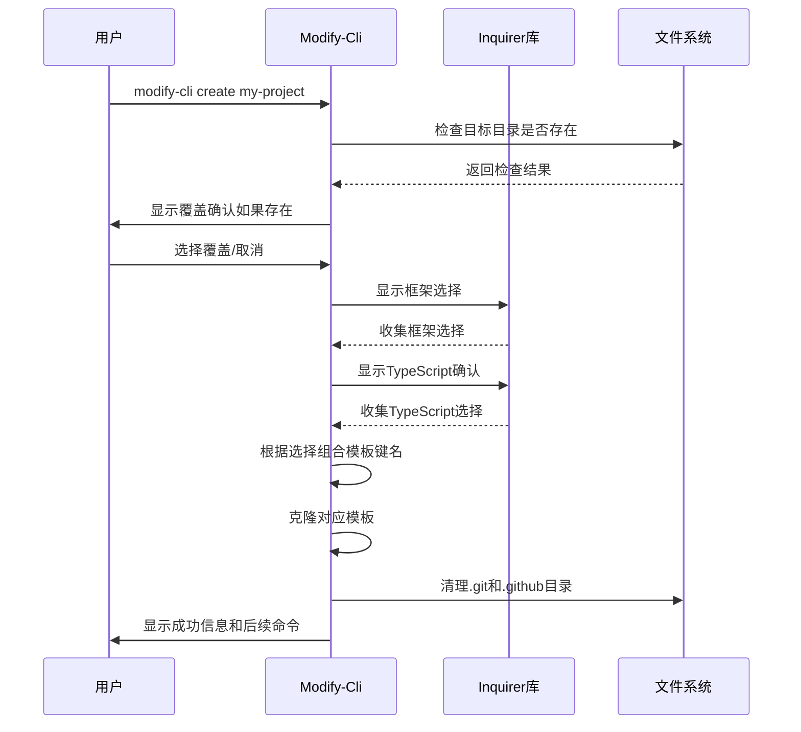
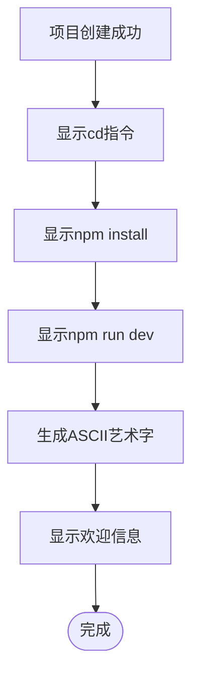

# 使用方法

<cite>
**本文档中引用的文件**
- [package.json](file://package.json)
- [bin/index.js](file://bin/index.js)
- [README.md](file://README.md)
</cite>

## 目录
1. [简介](#简介)
2. [安装与配置](#安装与配置)
3. [基本命令语法](#基本命令语法)
4. [交互式选择流程](#交互式选择流程)
5. [文件系统处理机制](#文件系统处理机制)
6. [模板选择与克隆](#模板选择与克隆)
7. [成功创建后的输出](#成功创建后的输出)
8. [错误处理与故障排除](#错误处理与故障排除)
9. [使用示例](#使用示例)
10. [注意事项](#注意事项)

## 简介

Modify-Cli 是一个命令行工具，专门用于快速创建前端项目。该工具基于 Commander 库构建命令行界面，通过交互式选择帮助用户快速搭建 Vue 或 React 项目，并支持 TypeScript 配置选项。

**节来源**
- [README.md](file://README.md#L1-L18)
- [package.json](file://package.json#L1-L25)

## 安装与配置

### 全局安装

```bash
npm install -g modify-cli
```

安装完成后，您可以通过以下命令验证安装：

```bash
modify-cli --version
```

### 依赖项说明

Modify-Cli 依赖以下关键模块：
- **commander**: 命令行参数解析和管理
- **inquirer**: 交互式命令行界面
- **fs-extra**: 增强的文件系统操作
- **git-clone**: Git 仓库克隆功能
- **figlet**: ASCII 艺术字生成
- **ora**: 加载动画显示
- **chalk**: 终端颜色样式化

**节来源**
- [package.json](file://package.json#L15-L24)

## 基本命令语法

### 命令格式

```bash
modify-cli create <project-name>
```

### 参数说明

- **project-name**: 必需参数，指定要创建的新项目的名称
- 支持的项目名称规则：符合文件系统命名规范的字符串

### 命令执行流程



**图表来源**
- [bin/index.js](file://bin/index.js#L25-L103)

**节来源**
- [bin/index.js](file://bin/index.js#L25-L35)

## 交互式选择流程

### 框架选择

当项目不存在或用户选择覆盖时，系统会显示交互式选择菜单：

```javascript
{
  type: "list",
  name: "template",
  message: "请选择技术框架",
  default: "vue",
  choices: ["vue", "react"],
}
```

**选择说明**：
- **vue**: Vue.js 框架
- **react**: React 框架
- 默认值为 "vue"

### TypeScript 选择

```javascript
{
  type: "confirm",
  name: "ts",
  message: "是否使用 typescript",
  default: true,
}
```

**选择说明**：
- **yes**: 创建 TypeScript 版本项目
- **no**: 创建 JavaScript 版本项目
- 默认值为 "true"（启用 TypeScript）

### 数据收集过程



**图表来源**
- [bin/index.js](file://bin/index.js#L36-L50)
- [bin/index.js](file://bin/index.js#L51-L70)

**节来源**
- [bin/index.js](file://bin/index.js#L51-L70)

## 文件系统处理机制

### 目录存在性检查

系统使用 `fs.existsSync()` 方法检查目标目录是否存在：

```javascript
const targetPath = path.join(process.cwd(), name);
const isExist = fs.existsSync(targetPath);
```

### 覆盖确认机制

当检测到目标目录已存在时，系统会弹出确认对话框：

```javascript
{
  type: "confirm",
  name: "overwrite",
  message: "当前文件夹已存在，是否覆盖",
  default: false,
}
```

**确认逻辑**：
- 如果用户选择 "是"，系统会删除现有目录并继续创建
- 如果用户选择 "否"，系统会提示更换项目名称并终止操作

### 文件删除操作

```javascript
fs.removeSync(targetPath);
```

使用同步的 `removeSync()` 方法确保目录完全删除后再进行下一步操作。

**节来源**
- [bin/index.js](file://bin/index.js#L36-L48)

## 模板选择与克隆

### 模板映射关系

系统根据用户选择的技术栈和 TypeScript 配置，从预定义的模板映射中选择对应的 Git 仓库：

```javascript
const gieResponse = {
  vue: "https://gitee.com/iamkun/dayjs.git",
  react: "https://gitee.com/iamkun/dayjs.git",
  "react-ts": "https://gitee.com/iamkun/dayjs.git",
  "vue-ts": "https://gitee.com/iamkun/dayjs.git",
};
```

### 当前问题说明

**重要警告**：所有模板都指向同一个 Git 仓库（dayjs），这意味着：
- 无论选择哪种技术栈，实际克隆的都是 dayjs 项目
- 这是一个已知问题，需要修复模板映射关系

### 克隆过程

```javascript
gitClone(gitUrl, name, { checkout: "master" }, (err) => {
  if (err) {
    console.log(chalk.red(err));
    spinner.fail(`${name} 项目创建失败！`);
  } else {
    spinner.succeed(`${name} 项目创建成功！`);
    // 清理.git和.github目录
    fs.removeSync(path.join(targetPath, ".git"));
    fs.removeSync(path.join(targetPath, ".github"));
  }
});
```

### 加载动画显示

使用 ora 库显示加载动画：

```javascript
const spinner = ora(`${name} Code Loading...`).start();
```

**节来源**
- [bin/index.js](file://bin/index.js#L11-L23)
- [bin/index.js](file://bin/index.js#L71-L85)

## 成功创建后的输出

### 标准输出格式

创建成功后，系统会显示以下标准化的后续操作指令：

```bash
cd <project-name>
npm install
npm run dev
```

### ASCII艺术字欢迎信息

使用 figlet 库生成欢迎信息：

```javascript
figlet("Modify-Cli!", function (err, data) {
  if (err) {
    console.dir(err);
    return;
  }
  console.log(data);
});
```

### 输出流程



**图表来源**
- [bin/index.js](file://bin/index.js#L86-L95)

**节来源**
- [bin/index.js](file://bin/index.js#L86-L95)

## 错误处理与故障排除

### 常见错误类型

1. **网络连接错误**
   - 原因：无法访问 Git 仓库
   - 解决方案：检查网络连接，确保可以访问 Gitee

2. **权限错误**
   - 原因：没有写入目标目录的权限
   - 解决方案：使用管理员权限运行或更改目标目录权限

3. **磁盘空间不足**
   - 原因：可用磁盘空间不足以克隆仓库
   - 解决方案：清理磁盘空间或选择其他位置

### 错误处理机制

```javascript
gitClone(gitUrl, name, { checkout: "master" }, (err) => {
  if (err) {
    console.log(chalk.red(err));
    spinner.fail(`${name} 项目创建失败！`);
  }
});
```

### 故障排除步骤

1. 检查网络连接状态
2. 验证目标目录权限
3. 确认磁盘空间充足
4. 尝试使用不同的项目名称
5. 检查防火墙设置

**节来源**
- [bin/index.js](file://bin/index.js#L71-L85)

## 使用示例

### 示例 1：创建 Vue 项目

```bash
$ modify-cli create my-vue-app
```

**交互过程**：
```
? 当前文件夹已存在，是否覆盖 No
? 请选择技术框架 (Use arrow keys)
❯ vue
  react
? 是否使用 typescript Yes
```

**输出结果**：
```
my-vue-app 项目创建成功！

  cd my-vue-app
  npm install
  npm run dev
  ____________  _________________  
  \______   \/   _____/\_   _____/  
   |     ___/\_____  \  |    __)_   
   |    |    /        \ |        \  
   |____|   /_______  //_______  /  
                    \/         \/   
```

### 示例 2：创建 React TypeScript 项目

```bash
$ modify-cli create my-react-ts
```

**交互过程**：
```
? 请选择技术框架 react
? 是否使用 typescript Yes
```

**输出结果**：
```
my-react-ts 项目创建成功！

  cd my-react-ts
  npm install
  npm run dev
  ____________  _________________  
  \______   \/   _____/\_   _____/  
   |     ___/\_____  \  |    __)_   
   |    |    /        \ |        \  
   |____|   /_______  //_______  /  
                    \/         \/   
```

### 示例 3：覆盖现有项目

```bash
$ modify-cli create existing-project
```

**交互过程**：
```
? 当前文件夹已存在，是否覆盖 Yes
? 请选择技术框架 vue
? 是否使用 typescript No
```

**节来源**
- [bin/index.js](file://bin/index.js#L25-L103)

## 注意事项

### 已知问题

1. **模板统一问题**
   - 所有技术栈模板都指向 dayjs 仓库
   - 需要修复模板映射关系以支持不同项目模板

2. **网络依赖**
   - 依赖 Gitee 服务，可能受网络状况影响
   - 建议在中国大陆地区使用以获得最佳体验

### 最佳实践建议

1. **项目命名**
   - 使用有意义的项目名称
   - 避免使用特殊字符和空格

2. **目录选择**
   - 选择合适的父目录
   - 确保有足够的磁盘空间

3. **网络环境**
   - 在稳定的网络环境下使用
   - 考虑使用代理或镜像源

### 功能限制

- 目前仅支持 Vue 和 React 框架
- TypeScript 选项为可选配置
- 不支持自定义模板路径
- 缺少项目初始化后的配置定制功能

**节来源**
- [bin/index.js](file://bin/index.js#L11-L23)