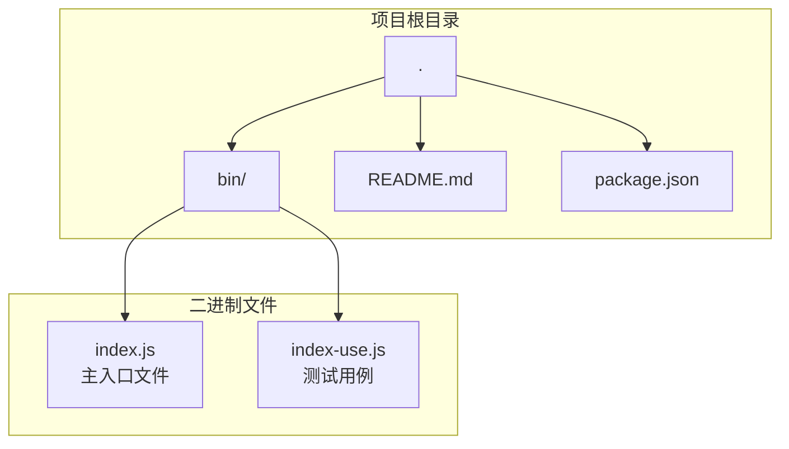
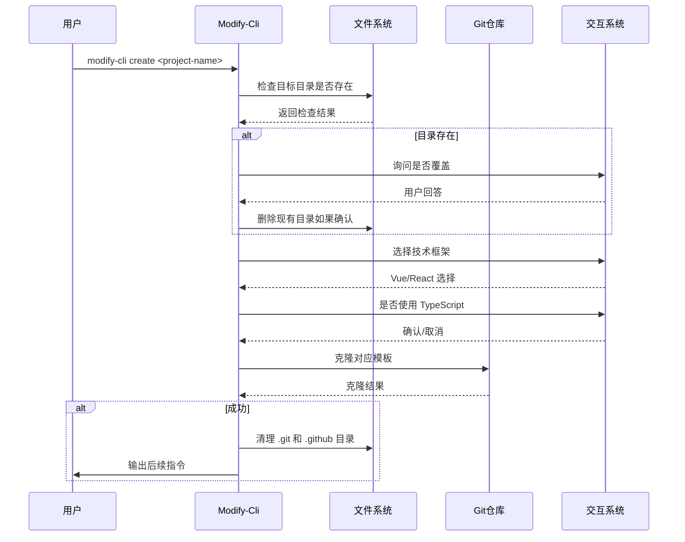
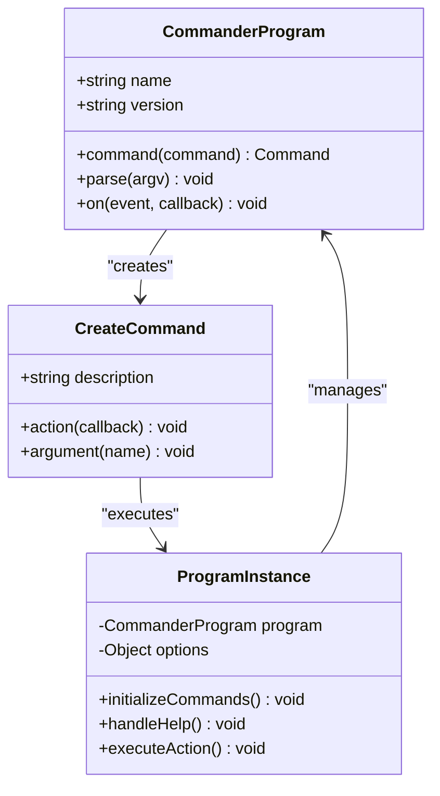
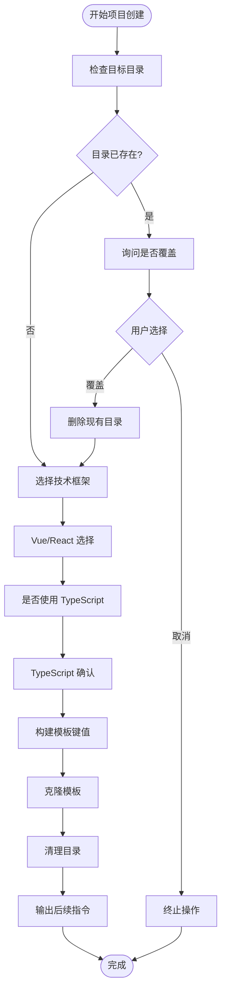
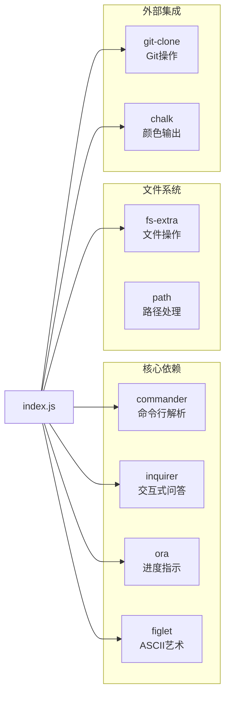

# Modify-Cli 工具概述

<cite>
**本文档中引用的文件**
- [README.md](file://README.md)
- [package.json](file://package.json)
- [bin/index.js](file://bin/index.js)
- [bin/index-use.js](file://bin/index-use.js)
</cite>

## 目录
1. [简介](#简介)
2. [项目结构](#项目结构)
3. [核心组件](#核心组件)
4. [架构概览](#架构概览)
5. [详细组件分析](#详细组件分析)
6. [依赖分析](#依赖分析)
7. [性能考虑](#性能考虑)
8. [故障排除指南](#故障排除指南)
9. [结论](#结论)

## 简介

Modify-Cli 是一个专为前端开发者设计的命令行工具，旨在简化新项目的创建过程。该工具通过交互式界面帮助开发者快速初始化前端项目，支持 Vue 和 React 框架以及 TypeScript 选项。它采用单入口驱动的设计模式，提供了简洁而强大的项目创建体验。

该工具的核心价值在于：
- **自动化项目初始化**：通过模板克隆和配置清理，快速生成标准化项目结构
- **用户友好界面**：基于 inquirer 的交互式问答系统，降低学习成本
- **多框架支持**：支持 Vue、React 及其 TypeScript 版本
- **现代化工具集成**：整合了主流 CLI 开发库，提供流畅的用户体验

## 项目结构

Modify-Cli 项目采用了简洁明了的目录结构，体现了模块化设计理念：



**图表来源**
- [bin/index.js](file://bin/index.js#L1-L104)
- [bin/index-use.js](file://bin/index-use.js#L1-L79)

**章节来源**
- [README.md](file://README.md#L1-L18)
- [package.json](file://package.json#L1-L25)

## 核心组件

### 主要功能模块

Modify-Cli 的核心功能集中在 `bin/index.js` 文件中，该文件实现了完整的项目创建工作流程：

1. **命令行接口管理**：基于 commander.js 实现命令解析和参数处理
2. **交互式用户界面**：使用 inquirer.js 提供问答式交互
3. **进度指示器**：通过 ora.js 显示加载状态和操作结果
4. **文件系统操作**：利用 fs-extra 进行安全的文件和目录操作
5. **Git 操作集成**：通过 git-clone 克隆远程模板仓库
6. **视觉效果增强**：使用 figlet 创建醒目的 ASCII 艺术标题

### 关键数据结构

```javascript
const gieResponse = {
  vue: "https://gitee.com/iamkun/dayjs.git",
  react: "https://gitee.com/iamkun/dayjs.git",
  "react-ts": "https://gitee.com/iamkun/dayjs.git",
  "vue-ts": "https://gitee.com/iamkun/dayjs.git",
};
```

这个对象定义了不同技术栈组合对应的 Git 模板 URL，虽然目前所有模板都指向同一个仓库（dayjs），这可能是未来需要改进的地方。

**章节来源**
- [bin/index.js](file://bin/index.js#L12-L17)
- [bin/index.js](file://bin/index.js#L25-L104)

## 架构概览

Modify-Cli 采用单入口驱动的架构模式，整个应用逻辑集中在主入口文件中：



**图表来源**
- [bin/index.js](file://bin/index.js#L25-L104)

## 详细组件分析

### 命令行接口组件



**图表来源**
- [bin/index.js](file://bin/index.js#L18-L24)
- [bin/index.js](file://bin/index.js#L26-L30)

### 交互式用户界面组件



**图表来源**
- [bin/index.js](file://bin/index.js#L31-L104)

### 模块依赖关系



**图表来源**
- [package.json](file://package.json#L15-L24)
- [bin/index.js](file://bin/index.js#L1-L11)

**章节来源**
- [bin/index.js](file://bin/index.js#L1-L11)
- [package.json](file://package.json#L15-L24)

### 错误处理机制

Modify-Cli 实现了多层次的错误处理策略：

1. **目录冲突检测**：当目标目录已存在时，提供明确的用户选择
2. **Git 操作错误处理**：捕获克隆过程中的网络或权限错误
3. **文件系统异常**：处理删除和清理操作中的潜在异常
4. **用户输入验证**：确保交互式问答的输入有效性

### 性能优化特性

- **异步操作**：所有 I/O 操作都是异步的，避免阻塞主线程
- **进度反馈**：使用 ora 显示实时进度，提升用户体验
- **资源清理**：及时清理临时文件和不需要的目录
- **内存管理**：合理使用内存，避免大型文件的重复加载

**章节来源**
- [bin/index.js](file://bin/index.js#L31-L104)

## 依赖分析

### 核心依赖库详解

Modify-Cli 依赖于多个成熟的 CLI 开发库，每个都有其特定的职责：

1. **commander.js**：提供命令行参数解析和帮助信息生成
2. **inquirer.js**：实现交互式用户问答系统
3. **ora.js**：显示加载动画和状态指示
4. **figlet.js**：生成 ASCII 艺术标题
5. **fs-extra**：增强的文件系统操作
6. **git-clone**：Git 仓库克隆功能
7. **chalk**：终端颜色输出美化

### 外部模板仓库问题

当前实现的一个重要限制是所有模板都指向同一个 Git 仓库（dayjs）。这种设计虽然简化了初始实现，但缺乏真正的模板分离：

```javascript
const gieResponse = {
  vue: "https://gitee.com/iamkun/dayjs.git",
  react: "https://gitee.com/iamkun/dayjs.git",
  "react-ts": "https://gitee.com/iamkun/dayjs.git",
  "vue-ts": "https://gitee.com/iamkun/dayjs.git",
};
```

这种设计需要在未来版本中改进为独立的模板仓库映射。

**章节来源**
- [bin/index.js](file://bin/index.js#L12-L17)
- [package.json](file://package.json#L15-L24)

## 性能考虑

### 内存使用优化

- **渐进式加载**：只在需要时加载相关模块
- **及时释放**：操作完成后立即释放不再使用的资源
- **流式处理**：对于大文件操作使用流式处理

### 网络性能

- **并发控制**：合理控制同时进行的网络请求数量
- **超时设置**：为 Git 操作设置合理的超时时间
- **重试机制**：在网络不稳定时提供重试功能

### 用户体验优化

- **即时反馈**：通过进度指示器提供实时状态更新
- **优雅降级**：在网络不可用时提供替代方案
- **缓存策略**：对频繁访问的数据实施缓存

## 故障排除指南

### 常见问题及解决方案

1. **模板克隆失败**
   - 检查网络连接
   - 验证 Git 仓库 URL 可访问性
   - 确认目标目录权限

2. **目录权限问题**
   - 使用管理员权限运行
   - 检查目标目录写入权限
   - 确保没有其他进程占用目录

3. **交互式问答中断**
   - 确保终端支持 ANSI 转义序列
   - 检查终端兼容性
   - 尝试在不同的终端环境中运行

### 调试技巧

- 启用详细日志记录
- 使用 --debug 参数获取更多信息
- 检查临时文件和目录状态
- 验证依赖库版本兼容性

**章节来源**
- [bin/index.js](file://bin/index.js#L65-L75)

## 结论

Modify-Cli 是一个设计精良的前端项目创建工具，展现了现代 CLI 应用的最佳实践。其主要优势包括：

### 设计优势

- **简洁的架构**：单入口设计降低了复杂性
- **模块化组件**：清晰的职责分离便于维护
- **用户友好**：直观的交互界面降低了使用门槛
- **可扩展性**：良好的模块化设计支持功能扩展

### 技术亮点

- **现代化工具链**：集成了最新的 CLI 开发最佳实践
- **错误处理**：完善的异常处理机制
- **用户体验**：丰富的视觉反馈和进度指示
- **跨平台兼容**：支持多种操作系统环境

### 改进建议

1. **模板分离**：为不同技术栈提供独立的模板仓库
2. **配置文件**：支持自定义配置文件覆盖默认设置
3. **插件系统**：允许第三方扩展功能
4. **国际化**：支持多语言界面
5. **模板预览**：提供模板预览功能

### 未来发展方向

Modify-Cli 作为一个基础的项目创建工具，具有很大的发展潜力。通过持续的功能迭代和技术升级，可以发展成为一个完整的前端工程化解决方案，为开发者提供更加丰富和智能的项目创建体验。