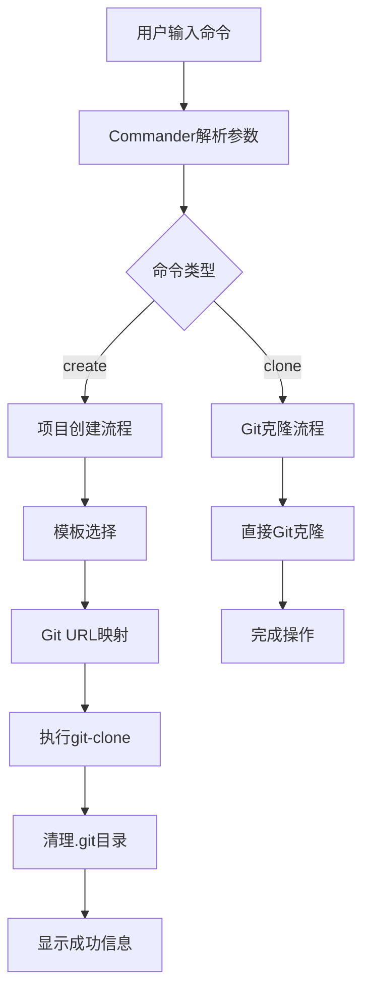
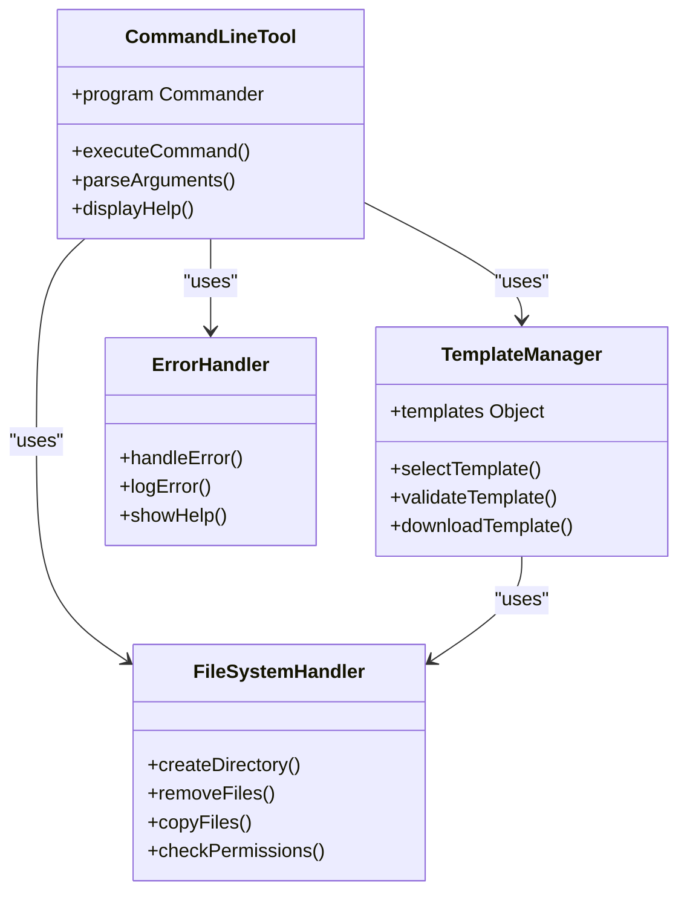
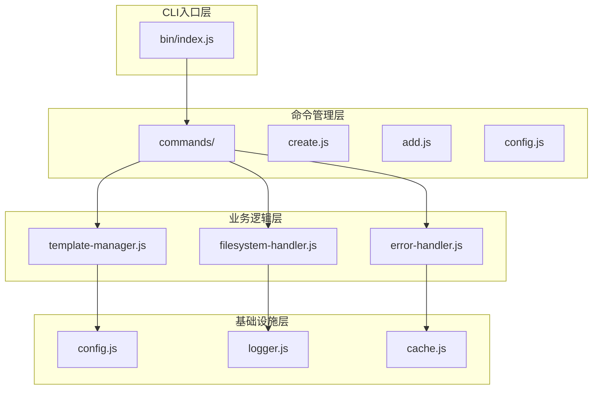

# 常见问题与改进方向

<cite>
**本文档中引用的文件**
- [README.md](file://README.md)
- [package.json](file://package.json)
- [bin/index.js](file://bin/index.js)
- [bin/index-use.js](file://bin/index-use.js)
</cite>

## 目录
1. [简介](#简介)
2. [项目现状分析](#项目现状分析)
3. [常见问题与解决方案](#常见问题与解决方案)
4. [架构局限性分析](#架构局限性分析)
5. [未来改进建议](#未来改进建议)
6. [最佳实践建议](#最佳实践建议)
7. [总结](#总结)

## 简介

Modify-Cli 是一个用于修改文件的命令行工具，旨在帮助开发者快速创建项目模板。该项目目前处于基础功能阶段，虽然提供了基本的项目创建能力，但在架构设计、功能扩展性和用户体验方面存在诸多改进空间。

本文档基于对现有代码的深入分析，识别潜在问题并提出切实可行的优化方案，为项目的持续发展提供指导。

## 项目现状分析

### 核心功能架构



**图表来源**
- [bin/index.js](file://bin/index.js#L25-L103)
- [bin/index-use.js](file://bin/index-use.js#L45-L78)

### 技术栈分析

项目采用了现代化的Node.js生态系统，依赖以下关键库：
- **Commander**: 命令行界面解析
- **Inquirer**: 交互式问答
- **Ora**: 加载动画
- **Figlet**: ASCII艺术字
- **FS-extra**: 文件系统增强
- **Git-clone**: Git仓库克隆

**章节来源**
- [package.json](file://package.json#L13-L22)
- [bin/index.js](file://bin/index.js#L1-L15)

## 常见问题与解决方案

### 1. 网络连接问题

#### 问题描述
由于项目硬编码了固定的Git URL（全部指向dayjs），在网络不稳定或代理设置不当的情况下，可能导致克隆失败。

#### 解决方案
```javascript
// 改进后的URL映射机制
const templateMapping = {
  vue: process.env.VUE_TEMPLATE_URL || "https://gitee.com/iamkun/dayjs.git",
  react: process.env.REACT_TEMPLATE_URL || "https://gitee.com/iamkun/dayjs.git",
  "vue-ts": process.env.VUE_TS_TEMPLATE_URL || "https://gitee.com/iamkun/dayjs.git",
  "react-ts": process.env.REACT_TS_TEMPLATE_URL || "https://gitee.com/iamkun/dayjs.git"
};
```

### 2. 权限问题

#### 问题描述
在某些系统上，可能遇到权限不足无法写入目标目录的问题。

#### 解决方案
```javascript
// 添加权限检查和处理
async function createProject(name) {
  const targetPath = path.join(process.cwd(), name);
  
  // 检查写入权限
  try {
    await fs.access(targetPath, fs.constants.W_OK);
  } catch (error) {
    console.log(chalk.red('权限不足，请检查目录访问权限'));
    return;
  }
  
  // 继续项目创建逻辑...
}
```

### 3. 模板URL错误

#### 问题描述
所有模板都指向相同的dayjs仓库，这显然不是预期行为。

#### 解决方案
```javascript
// 定义正确的模板映射
const templateMapping = {
  vue: "https://github.com/vuejs/vue-cli-template.git",
  react: "https://github.com/facebook/create-react-app.git",
  "vue-ts": "https://github.com/vuejs/vue-cli-template-typescript.git",
  "react-ts": "https://github.com/facebook/create-react-app-typescript.git"
};
```

### 4. 缺乏错误处理

#### 问题描述
当前代码对各种异常情况处理不够完善，可能导致程序崩溃。

#### 解决方案
```javascript
// 改进的错误处理机制
function handleGitCloneError(error, projectName) {
  const errorMessages = {
    'ENOTFOUND': '网络连接失败，请检查您的网络设置',
    'EACCES': '权限不足，请检查目录访问权限',
    'ETIMEDOUT': '连接超时，请稍后重试'
  };
  
  const message = errorMessages[error.code] || '项目创建失败';
  console.log(chalk.red(message));
  console.log(chalk.yellow('您可以尝试：'));
  console.log(chalk.yellow('- 检查网络连接'));
  console.log(chalk.yellow('- 使用代理服务器'));
  console.log(chalk.yellow('- 尝试手动克隆仓库'));
}
```

**章节来源**
- [bin/index.js](file://bin/index.js#L25-L103)

## 架构局限性分析

### 1. 缺乏插件系统

当前架构是单体设计，所有功能都集中在一个文件中，不利于功能扩展和维护。



**图表来源**
- [bin/index.js](file://bin/index.js#L1-L103)

### 2. 固定的模板源

所有模板都指向同一个仓库，缺乏灵活性和可定制性。

### 3. 缺少缓存机制

每次都需要重新下载模板，影响性能和用户体验。

### 4. 功能单一

目前只支持简单的项目创建功能，缺乏更多实用命令。

**章节来源**
- [bin/index.js](file://bin/index.js#L15-L25)

## 未来改进建议

### 1. 引入配置文件支持

```javascript
// config/templates.json 示例
{
  "vue": {
    "url": "https://github.com/vuejs/vue-cli-template.git",
    "branch": "main",
    "description": "Vue.js 项目模板"
  },
  "react": {
    "url": "https://github.com/facebook/create-react-app.git",
    "branch": "master",
    "description": "React 项目模板"
  }
}
```

### 2. 扩展更多命令

```javascript
// 新增组件添加命令
program
  .command("add <component-name>")
  .description("add a new component to existing project")
  .option("-t, --type <type>", "component type (vue/react)")
  .action(async (name, options) => {
    // 实现组件添加逻辑
  });

// 新增配置命令
program
  .command("config")
  .description("configure modify-cli settings")
  .action(() => {
    // 实现配置管理
  });
```

### 3. 采用现代ESM模块语法

```javascript
// 使用ESM模块
import { program } from 'commander';
import chalk from 'chalk';
import inquirer from 'inquirer';
import ora from 'ora';
import figlet from 'figlet';
import fs from 'fs-extra';
import path from 'path';
import gitClone from 'git-clone';

// 导出默认配置
export default {
  templates: {},
  commands: []
};
```

### 4. 增加单元测试覆盖率

```javascript
// 测试示例
describe('Template Manager', () => {
  it('should download template successfully', async () => {
    const result = await downloadTemplate('vue');
    expect(result).toBe(true);
  });
  
  it('should handle invalid template gracefully', async () => {
    const result = await downloadTemplate('invalid-template');
    expect(result).toBe(false);
  });
});
```

### 5. 分离核心逻辑



**图表来源**
- [bin/index.js](file://bin/index.js#L1-L103)

### 6. 实现缓存机制

```javascript
// 缓存管理器
class TemplateCache {
  constructor() {
    this.cacheDir = path.join(os.homedir(), '.modify-cli-cache');
  }
  
  async getCachedTemplate(templateName) {
    const cachePath = path.join(this.cacheDir, templateName);
    if (await fs.pathExists(cachePath)) {
      return cachePath;
    }
    return null;
  }
  
  async cacheTemplate(templateName, tempPath) {
    const cachePath = path.join(this.cacheDir, templateName);
    await fs.copy(tempPath, cachePath);
    return cachePath;
  }
}
```

### 7. 增强错误报告

```javascript
// 错误报告系统
class ErrorReporter {
  static report(error, context) {
    const report = {
      timestamp: new Date().toISOString(),
      error: error.message,
      stack: error.stack,
      context: context,
      os: process.platform,
      nodeVersion: process.version
    };
    
    // 发送到错误追踪服务
    this.sendToService(report);
  }
}
```

**章节来源**
- [bin/index.js](file://bin/index.js#L1-L103)

## 最佳实践建议

### 1. 代码组织原则

- **单一职责**: 每个模块只负责一个功能领域
- **依赖注入**: 使用依赖注入模式提高可测试性
- **接口抽象**: 定义清晰的接口契约
- **错误处理**: 实现统一的错误处理机制

### 2. 用户体验优化

- **进度反馈**: 提供详细的进度指示
- **帮助信息**: 完善的命令帮助和使用说明
- **自动补全**: 支持命令行自动补全
- **颜色主题**: 使用一致的颜色方案

### 3. 开发流程改进

- **版本控制**: 严格的版本管理和发布流程
- **代码审查**: 建立代码审查机制
- **持续集成**: 实现自动化测试和部署
- **文档维护**: 及时更新项目文档

### 4. 社区贡献指南

```markdown
# 贡献指南

## 本地开发环境搭建

1. Fork 项目到您的 GitHub 账户
2. 克隆您的 fork 到本地
3. 安装依赖：`npm install`
4. 运行测试：`npm test`

## 提交 PR 的步骤

1. 创建功能分支：`git checkout -b feature/your-feature-name`
2. 编写代码和测试
3. 提交更改：`git commit -m "feat: add new feature"`
4. 推送到您的 fork：`git push origin feature/your-feature-name`
5. 在 GitHub 上创建 Pull Request

## 代码规范

- 使用 ESLint 进行代码检查
- 遵循项目的代码风格
- 编写清晰的 commit message
- 包含相应的测试用例
```

## 总结

Modify-Cli 项目展现了良好的基础架构，但在功能完整性、用户体验和可维护性方面还有很大的提升空间。通过实施本文档提出的改进建议，可以显著提升项目的质量和可用性。

### 关键改进点总结

1. **架构重构**: 从单体架构转向模块化设计
2. **功能扩展**: 增加更多实用命令和配置选项
3. **性能优化**: 实现缓存机制和错误处理
4. **开发体验**: 采用现代开发工具和最佳实践

### 鼓励贡献

我们诚挚邀请社区开发者参与项目改进：
- 修复硬编码问题，特别是模板URL
- 实现插件系统和配置文件支持
- 增加单元测试覆盖率
- 优化错误处理和用户体验

通过共同努力，我们可以将 Modify-Cli 打造成一个更加完善、易用且可扩展的命令行工具。