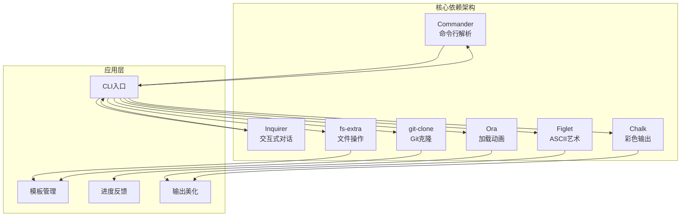
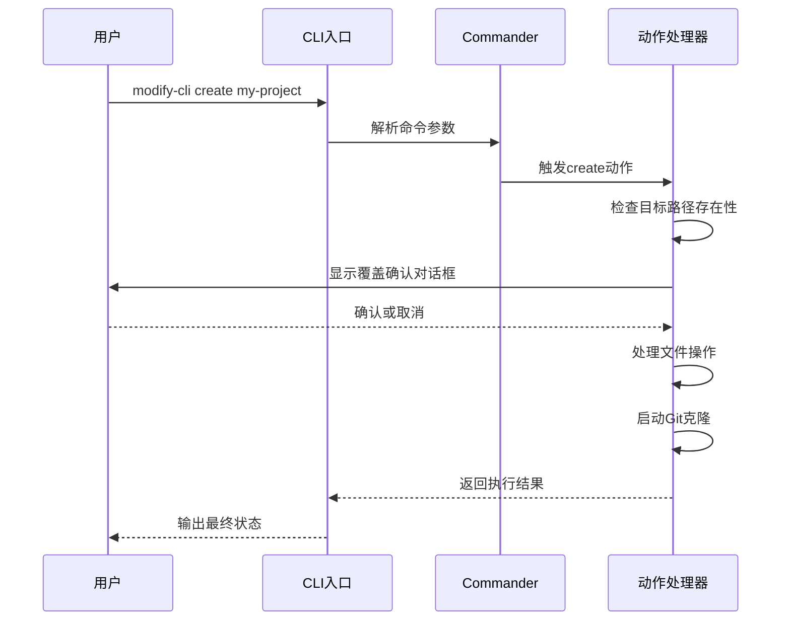
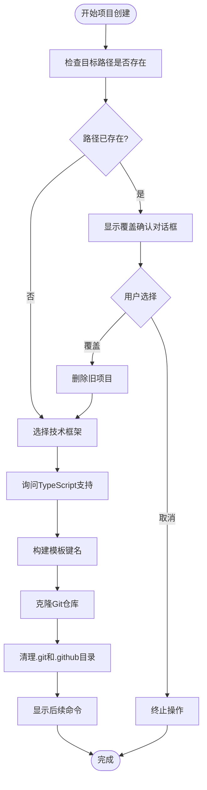
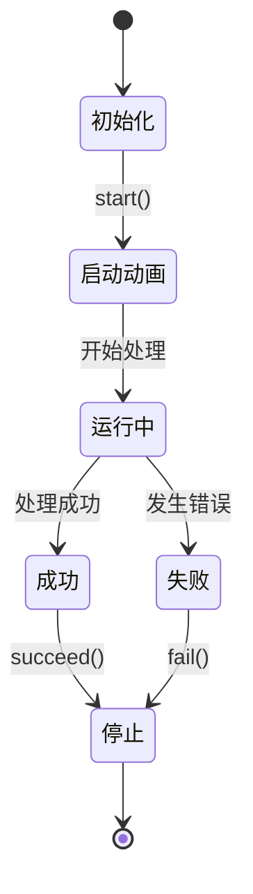
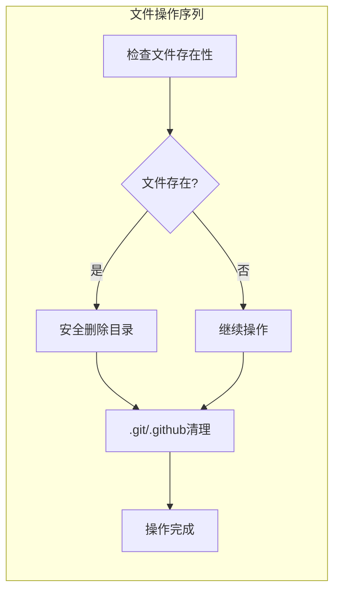
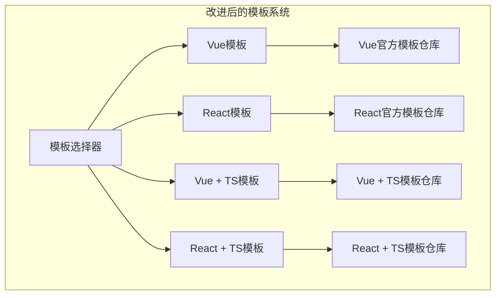
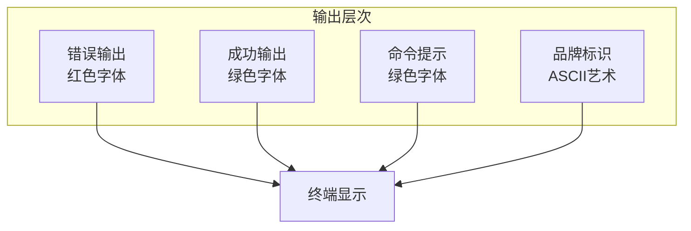
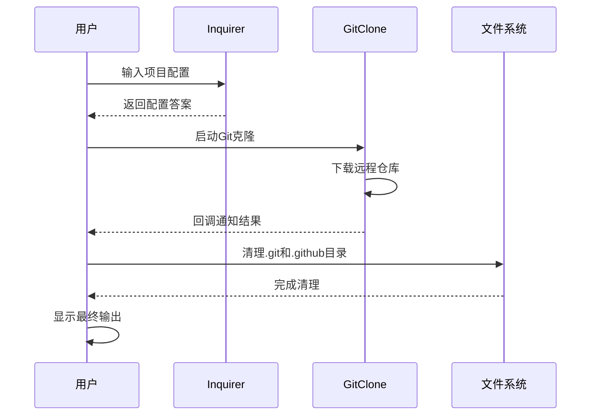
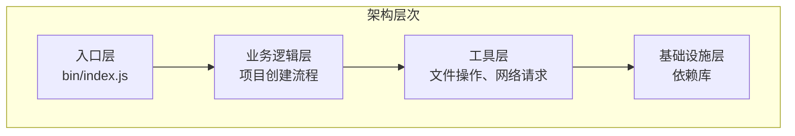
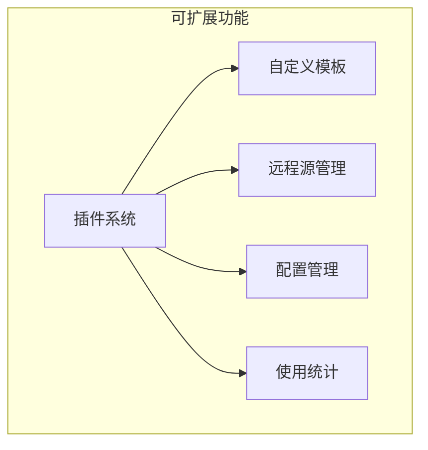

# Modify-Cli 核心功能实现详解

<cite>
**本文档引用的文件**
- [package.json](file://package.json)
- [bin/index.js](file://bin/index.js)
- [README.md](file://README.md)
</cite>

## 目录
1. [项目概述](#项目概述)
2. [核心依赖分析](#核心依赖分析)
3. [Commander 命令行解析](#commander-命令行解析)
4. [Inquirer 交互式对话](#inquirer-交互式对话)
5. [Ora 加载动画机制](#ora-加载动画机制)
6. [fs-extra 文件操作](#fs-extra-文件操作)
7. [模板URL选择策略](#模板url选择策略)
8. [终端输出美化](#终端输出美化)
9. [异步操作处理](#异步操作处理)
10. [架构设计与优化建议](#架构设计与优化建议)

## 项目概述

Modify-Cli 是一个命令行工具，旨在为开发者提供项目模板快速创建的功能。该项目通过整合多个现代化的 Node.js 库，实现了完整的 CLI 工具链，包括命令行参数解析、用户交互、进度反馈和文件操作等核心功能。

**章节来源**
- [package.json](file://package.json#L1-L25)
- [README.md](file://README.md#L1-L18)

## 核心依赖分析

Modify-Cli 项目集成了多个关键的第三方库，每个库都承担着特定的功能职责：



**图表来源**
- [package.json](file://package.json#L15-L22)

这些依赖库形成了一个完整的 CLI 工具生态系统：
- **Commander**：负责命令行参数的解析和验证
- **Inquirer**：提供交互式的用户对话界面
- **Ora**：为长时间运行的操作提供视觉反馈
- **Figlet** 和 **Chalk**：增强终端输出的可读性和美观性
- **fs-extra** 和 **git-clone**：提供强大的文件操作和 Git 克隆功能

**章节来源**
- [package.json](file://package.json#L15-L22)

## Commander 命令行解析

Commander 库在 modify-cli 中扮演着核心角色，负责解析用户输入的命令行参数并触发相应的操作。

### 命令定义与注册

```javascript
program
  .command("create <project-name>")
  .description("create a new project")
  .action(async (name) => {
    // 项目创建逻辑
  });
```

### 参数验证与处理

Commander 自动处理以下功能：
- **参数类型检查**：确保 `<project-name>` 参数的存在和格式正确
- **帮助信息生成**：当用户输入 `--help` 时自动生成详细的使用说明
- **版本控制**：集成项目版本信息到命令行输出中

### 命令执行流程



**图表来源**
- [bin/index.js](file://bin/index.js#L25-L103)

**章节来源**
- [bin/index.js](file://bin/index.js#L25-L35)

## Inquirer 交互式对话

Inquirer 库提供了两个关键的交互式对话功能，用于收集用户的项目配置偏好。

### 技术框架选择

```javascript
{
  type: "list",
  name: "template",
  message: "请选择技术框架",
  default: "vue",
  choices: ["vue", "react"],
}
```

### TypeScript 支持确认

```javascript
{
  type: "confirm",
  name: "ts",
  message: "是否使用 typescript",
  default: true,
}
```

### 对话流程设计



**图表来源**
- [bin/index.js](file://bin/index.js#L36-L60)

这种设计确保了用户能够灵活地选择项目配置，同时提供了清晰的确认机制防止意外覆盖现有项目。

**章节来源**
- [bin/index.js](file://bin/index.js#L45-L60)

## Ora 加载动画机制

Ora 库为 modify-cli 提供了优雅的加载动画和状态反馈机制，显著提升了用户体验。

### 动画初始化与启动

```javascript
const spinner = ora(`${name} Code Loading...`).start();
```

### 状态管理

Ora 支持三种主要的状态反馈：
- **启动状态**：显示加载动画和初始消息
- **成功状态**：动画停止并显示成功图标和消息
- **失败状态**：动画停止并显示错误图标和错误消息

### 动画生命周期



**图表来源**
- [bin/index.js](file://bin/index.js#L70-L85)

### 实际应用场景

在 Git 克隆过程中，Ora 动画提供了以下价值：
- **视觉反馈**：让用户知道程序正在工作而不是卡住
- **时间感知**：帮助用户估计等待时间
- **状态指示**：明确显示操作的成功或失败状态

**章节来源**
- [bin/index.js](file://bin/index.js#L70-L85)

## fs-extra 文件操作

fs-extra 库扩展了 Node.js 原生 fs 模块的功能，为 modify-cli 提供了更强大和安全的文件操作能力。

### 文件存在性检查

```javascript
const isExist = fs.existsSync(targetPath);
```

### 安全的目录删除

```javascript
fs.removeSync(targetPath);
```

### 文件清理操作

```javascript
fs.removeSync(path.join(targetPath, ".git"));
fs.removeSync(path.join(targetPath, ".github"));
```

### 文件操作流程



**图表来源**
- [bin/index.js](file://bin/index.js#L36-L45)

fs-extra 的优势在于：
- **同步API**：简化了错误处理逻辑
- **递归删除**：自动处理深层目录结构
- **错误处理**：提供更详细的错误信息

**章节来源**
- [bin/index.js](file://bin/index.js#L36-L45)
- [bin/index.js](file://bin/index.js#L80-L85)

## 模板URL选择策略

modify-cli 使用了一个简单的键值映射系统来选择不同的项目模板 URL。

### URL 映射表

```javascript
const gieResponse = {
  vue: "https://gitee.com/iamkun/dayjs.git",
  react: "https://gitee.com/iamkun/dayjs.git",
  "react-ts": "https://gitee.com/iamkun/dayjs.git",
  "vue-ts": "https://gitee.com/iamkun/dayjs.git",
};
```

### 键名构建逻辑

```javascript
const key = ts ? `${template}-ts` : template;
const gitUrl = gieResponse[key];
```

### 当前问题分析

目前存在的严重问题：
- **所有模板URL都指向同一个仓库**：dayjs 仓库
- **缺乏实际的模板差异**：无法根据选择的技术栈提供不同的模板
- **域名一致性问题**：所有URL都使用 gitee.com

### 改进建议



**章节来源**
- [bin/index.js](file://bin/index.js#L11-L16)
- [bin/index.js](file://bin/index.js#L65-L70)

## 终端输出美化

modify-cli 使用了多种技术来提升终端输出的可读性和美观性。

### Chalk 彩色输出

```javascript
console.log(chalk.red.underline("请更换一个项目名称，再重新创建"));
console.log(chalk.green(`\r\n  cd ${name}`));
console.log(chalk.green("  npm install"));
console.log(chalk.green("  npm run dev"));
```

### Figlet ASCII艺术

```javascript
figlet("Modify-Cli!", function (err, data) {
  if (err) {
    console.dir(err);
    return;
  }
  console.log(data);
});
```

### 输出层次结构



**图表来源**
- [bin/index.js](file://bin/index.js#L85-L95)

### 输出设计原则

- **颜色语义化**：错误用红色，成功用绿色
- **层级分明**：重要信息突出显示
- **格式统一**：保持一致的输出风格
- **品牌识别**：通过 ASCII 艺术增强品牌认知

**章节来源**
- [bin/index.js](file://bin/index.js#L85-L95)

## 异步操作处理

modify-cli 采用了 Promise 和回调函数相结合的方式来处理异步操作，这种混合模式在现代 JavaScript 开发中很常见。

### 当前实现模式

```javascript
inquirer
  .prompt([
    // 交互式对话配置
  ])
  .then((answers) => {
    // 处理用户输入
    const { template, ts } = answers;
    const key = ts ? `${template}-ts` : template;
    const gitUrl = gieResponse[key];
    const spinner = ora(`${name} Code Loading...`).start();
    
    gitClone(gitUrl, name, { checkout: "master" }, (err) => {
      // Git克隆回调处理
      if (err) {
        console.log(chalk.red(err));
        spinner.fail(`${name} 项目创建失败！`);
      } else {
        spinner.succeed(`${name} 项目创建成功！`);
        // 后续文件操作
      }
    });
  });
```

### 异步流程图



**图表来源**
- [bin/index.js](file://bin/index.js#L45-L95)

### 混合模式的优势与挑战

**优势**：
- **兼容性**：支持不同库的异步接口
- **灵活性**：可以根据需要选择最适合的异步模式
- **渐进式采用**：可以逐步迁移到纯 Promise 模式

**挑战**：
- **复杂性增加**：嵌套回调可能导致"回调地狱"
- **错误处理困难**：需要在多个层级处理错误
- **代码可读性下降**：异步流程不够直观

### 改进建议

```javascript
// 推荐的 Promise 化改造
async function createProject(name) {
  try {
    // 检查路径存在性
    const targetPath = path.join(process.cwd(), name);
    const isExist = fs.existsSync(targetPath);
    
    if (isExist) {
      const answers = await inquirer.prompt([
        {
          type: "confirm",
          name: "overwrite",
          message: "当前文件夹已存在，是否覆盖",
          default: false,
        },
      ]);
      
      if (!answers.overwrite) {
        throw new Error("用户取消操作");
      }
      
      await fs.removeAsync(targetPath);
    }
    
    // 获取用户配置
    const answers = await inquirer.prompt([
      {
        type: "list",
        name: "template",
        message: "请选择技术框架",
        default: "vue",
        choices: ["vue", "react"],
      },
      {
        type: "confirm",
        name: "ts",
        message: "是否使用 typescript",
        default: true,
      },
    ]);
    
    // 构建模板键名并克隆
    const { template, ts } = answers;
    const key = ts ? `${template}-ts` : template;
    const gitUrl = gieResponse[key];
    
    const spinner = ora(`${name} Code Loading...`).start();
    await gitCloneAsync(gitUrl, name, { checkout: "master" });
    spinner.succeed(`${name} 项目创建成功！`);
    
    // 清理残留文件
    await fs.removeAsync(path.join(targetPath, ".git"));
    await fs.removeAsync(path.join(targetPath, ".github"));
    
    // 显示后续命令
    console.log(chalk.green(`\r\n  cd ${name}`));
    console.log(chalk.green("  npm install"));
    console.log(chalk.green("  npm run dev"));
    
  } catch (error) {
    console.log(chalk.red(error.message));
  }
}
```

**章节来源**
- [bin/index.js](file://bin/index.js#L45-L95)

## 架构设计与优化建议

### 整体架构评估

modify-cli 采用了模块化的架构设计，每个依赖库都有明确的职责分工：



### 当前架构优势

1. **职责分离**：每个库专注于特定功能领域
2. **易于维护**：模块化设计便于单独更新和测试
3. **功能丰富**：集成了完整的 CLI 工具链
4. **用户体验良好**：提供了丰富的视觉反馈

### 存在的问题与改进建议

#### 1. 模板系统问题
**问题**：所有模板URL都指向 dayjs 仓库
**解决方案**：
- 实现真实的模板仓库映射
- 支持自定义模板源
- 添加模板验证机制

#### 2. 异步处理优化
**问题**：混合使用 Promise 和回调
**解决方案**：
- 将所有异步操作转换为 Promise 模式
- 使用 async/await 语法简化代码结构
- 实现统一的错误处理机制

#### 3. 错误处理改进
**问题**：错误处理分散且不够完善
**解决方案**：
- 实现全局错误处理器
- 添加详细的错误日志记录
- 提供友好的错误恢复建议

#### 4. 测试覆盖不足
**问题**：缺少单元测试和集成测试
**解决方案**：
- 添加 Jest 单元测试
- 实现 E2E 测试套件
- 建立 CI/CD 流水线

### 性能优化建议

1. **并发处理**：对于独立的异步操作，考虑使用 Promise.all 并发执行
2. **缓存机制**：缓存常用的模板URL查询结果
3. **进度报告**：在 Git 克隆过程中提供更详细的进度信息
4. **内存管理**：及时释放不再使用的资源

### 可扩展性设计



通过实施这些建议，modify-cli 可以发展成为一个更加健壮、可维护和用户友好的 CLI 工具平台。