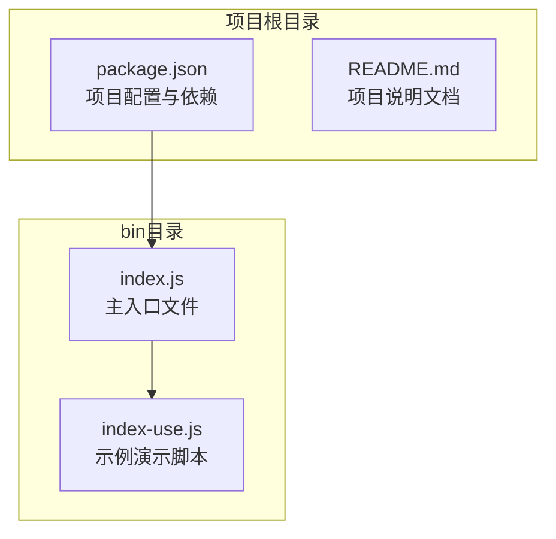
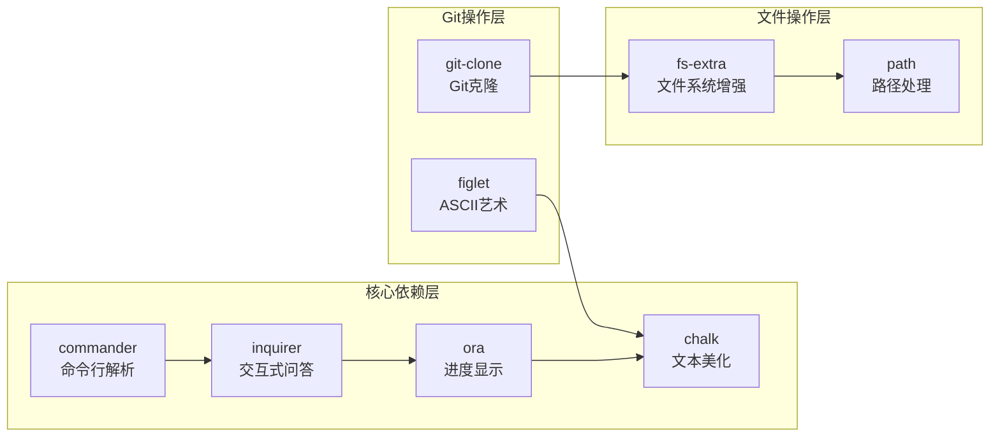
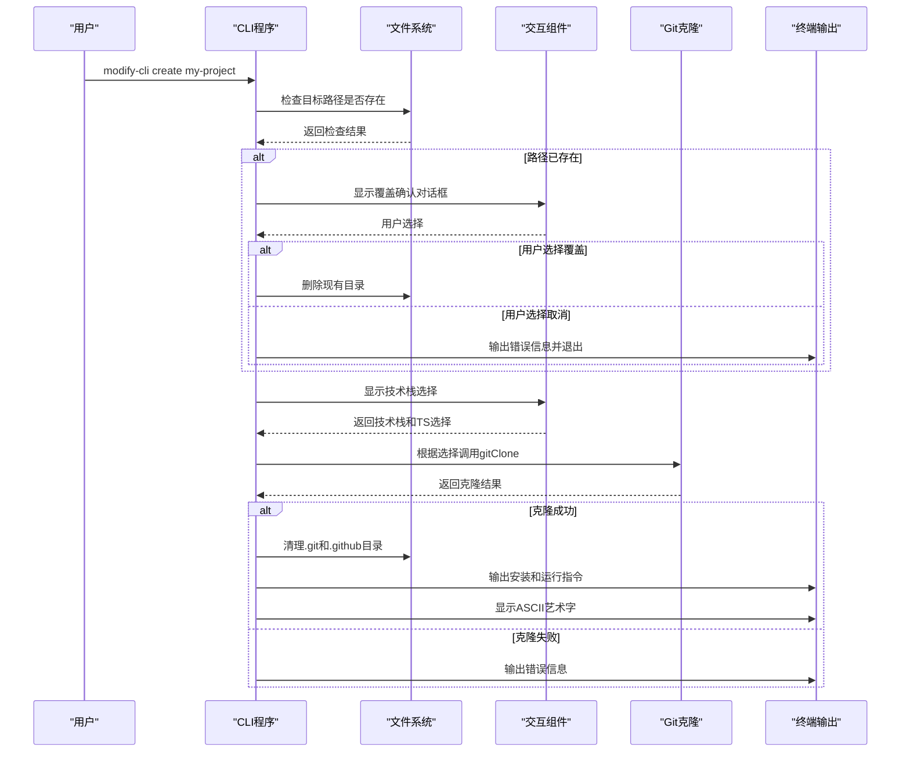
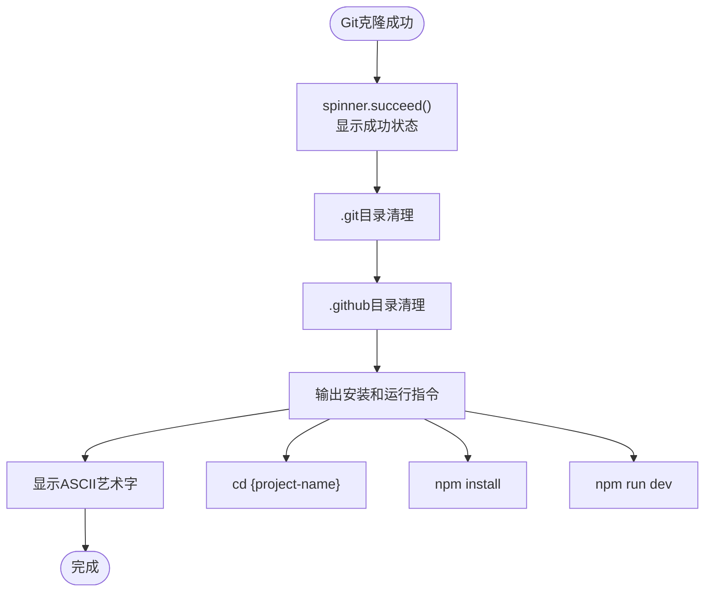
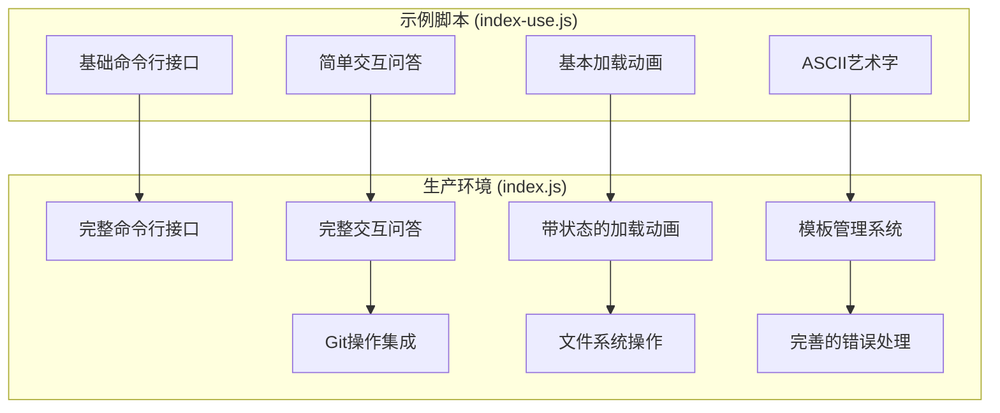

# 源码简介

<cite>
**本文档中引用的文件**
- [package.json](file://package.json)
- [bin/index.js](file://bin/index.js)
- [bin/index-use.js](file://bin/index-use.js)
- [README.md](file://README.md)
</cite>

## 目录
1. [项目概述](#项目概述)
2. [项目结构](#项目结构)
3. [核心依赖分析](#核心依赖分析)
4. [主入口文件分析](#主入口文件分析)
5. [命令行接口设计](#命令行接口设计)
6. [交互式问答系统](#交互式问答系统)
7. [Git克隆功能实现](#git克隆功能实现)
8. [示例脚本对比](#示例脚本对比)
9. [架构设计与优化建议](#架构设计与优化建议)
10. [总结](#总结)

## 项目概述

Modify-Cli 是一个命令行工具，旨在帮助用户快速创建基于不同技术栈的项目模板。该项目的核心理念是"可以不造轮子，但要知道怎么造"，通过提供可定制的CLI工具模板，让用户了解如何构建自己的命令行应用程序。

项目采用模块化设计，集成了多种第三方库来实现完整的命令行功能，包括命令解析、交互式问答、进度显示、文件操作等核心功能。

## 项目结构



**图表来源**
- [package.json](file://package.json#L1-L25)
- [bin/index.js](file://bin/index.js#L1-L104)

**章节来源**
- [package.json](file://package.json#L1-L25)
- [README.md](file://README.md#L1-L18)

## 核心依赖分析

项目的主要依赖库及其作用如下：

### 命令行解析与处理
- **commander**: 提供命令行参数解析和命令定义功能
- **chalk**: 用于终端文本颜色和样式美化
- **ora**: 显示加载动画和状态指示器
- **figlet**: 在终端中生成ASCII艺术字效果

### 用户交互与输入处理
- **inquirer**: 创建交互式命令行界面，支持各种类型的用户输入
- **fs-extra**: 增强的文件系统操作库，提供更丰富的文件处理功能

### Git操作与模板管理
- **git-clone**: 实现Git仓库的克隆功能
- **path**: Node.js内置模块，用于路径处理



**图表来源**
- [package.json](file://package.json#L15-L22)
- [bin/index.js](file://bin/index.js#L1-L10)

**章节来源**
- [package.json](file://package.json#L15-L22)

## 主入口文件分析

主入口文件 `bin/index.js` 采用了清晰的模块化结构，包含以下关键部分：

### 文件头部导入与常量定义

```javascript
// 导入核心依赖
const { program } = require("commander");
const chalk = require("chalk");
const inquirer = require("inquirer");
const ora = require("ora");
const figlet = require("figlet");
const fs = require("fs-extra");
const path = require("path");
const gitClone = require("git-clone");

// 硬编码的模板URL映射
const gieResponse = {
  vue: "https://gitee.com/iamkun/dayjs.git",
  react: "https://gitee.com/iamkun/dayjs.git",
  react-ts: "https://gitee.com/iamkun/dayjs.git",
  vue-ts: "https://gitee.com/iamkun/dayjs.git",
};
```

### 命令行程序初始化

```javascript
// 设置程序基本信息
program.name("modify-cli").usage("<command> [options]");
program.version(`v${require("../package.json").version}`);

// 帮助信息监听
program.on("--help", () => {
  console.log(
    `\r\nRun ${chalk.cyan(
      "modify-cli <command> --help"
    )} for detailed usage of given command\r\n`
  );
});
```

### create命令的完整生命周期



**图表来源**
- [bin/index.js](file://bin/index.js#L25-L104)

**章节来源**
- [bin/index.js](file://bin/index.js#L1-L104)

## 命令行接口设计

### commander库的使用

项目使用 `commander` 库实现了完整的命令行接口设计：

```javascript
program
  .command("create <project-name>")
  .description("create a new project")
  .action(async (name) => {
    // 命令执行逻辑
  });
```

### 参数验证与路径处理

```javascript
// 获取目标路径并检查是否存在
const targetPath = path.join(process.cwd(), name);
const isExist = fs.existsSync(targetPath);
```

### 错误处理机制

当检测到目标路径已存在时，程序会：
1. 使用 `inquirer.prompt()` 显示确认对话框
2. 根据用户选择决定继续或终止操作
3. 提供友好的错误提示信息

**章节来源**
- [bin/index.js](file://bin/index.js#L25-L45)

## 交互式问答系统

### inquirer库的配置

项目使用 `inquirer` 库构建了两个层次的交互式问答：

#### 第一层：路径冲突处理
```javascript
{
  type: "confirm",
  name: "overwrite",
  message: "当前文件夹已存在，是否覆盖",
  default: false,
}
```

#### 第二层：项目配置选择
```javascript
{
  type: "list",
  name: "template",
  message: "请选择技术框架",
  default: "vue",
  choices: ["vue", "react"],
},
{
  type: "confirm",
  name: "ts",
  message: "是否使用 typescript",
  default: true,
}
```

### 动态模板URL选择

根据用户的交互选择，程序动态构建模板URL：

```javascript
const { template, ts } = answers;
const key = ts ? `${template}-ts` : template;
const gitUrl = gieResponse[key];
```

这种设计允许：
- 支持多种技术栈（Vue、React）
- 支持TypeScript和JavaScript两种变体
- 通过简单的字符串拼接实现灵活的模板选择

**章节来源**
- [bin/index.js](file://bin/index.js#L46-L75)

## Git克隆功能实现

### 异步调用与错误处理

```javascript
gitClone(gitUrl, name, { checkout: "master" }, (err) => {
  if (err) {
    console.log(chalk.red(err));
    spinner.fail(`${name} 项目创建失败！`);
  } else {
    spinner.succeed(`${name} 项目创建成功！`);
    // 后续清理和提示逻辑
  }
});
```

### 成功分支处理流程



**图表来源**
- [bin/index.js](file://bin/index.js#L85-L104)

### 失败分支处理逻辑

当Git克隆失败时：
1. 使用 `chalk.red()` 美化错误信息
2. 使用 `spinner.fail()` 显示失败状态
3. 终止后续操作流程

**章节来源**
- [bin/index.js](file://bin/index.js#L76-L104)

## 示例脚本对比

### index-use.js的功能差异

示例脚本 `index-use.js` 展示了CLI工具的基础功能，但与主入口文件有以下重要区别：

#### 功能范围对比

| 功能特性 | index-use.js | index.js |
|---------|-------------|----------|
| 基础命令行接口 | ✅ | ✅ |
| 交互式问答 | ✅ | ✅ |
| 加载动画 | ✅ | ✅ |
| ASCII艺术字 | ✅ | ✅ |
| 文件系统操作 | ❌ | ✅ |
| Git克隆功能 | ❌ | ✅ |
| 项目模板管理 | ❌ | ✅ |

#### 代码复杂度对比



**图表来源**
- [bin/index-use.js](file://bin/index-use.js#L1-L79)
- [bin/index.js](file://bin/index.js#L1-L104)

### 演示用途说明

示例脚本 `index-use.js` 的主要特点：
- 仅展示基础功能，不涉及实际业务逻辑
- 用于演示CLI工具的开发模式
- 不参与实际的项目发布和部署
- 提供学习参考价值

**章节来源**
- [bin/index-use.js](file://bin/index-use.js#L1-L79)

## 架构设计与优化建议

### 当前架构问题分析

#### 硬编码模板URL问题

目前项目存在以下架构设计问题：

```javascript
const gieResponse = {
  vue: "https://gitee.com/iamkun/dayjs.git",
  react: "https://gitee.com/iamkun/dayjs.git",
  react-ts: "https://gitee.com/iamkun/dayjs.git",
  vue-ts: "https://gitee.com/iamkun/dayjs.git",
};
```

问题描述：
1. **重复性高**: 所有模板都指向同一个仓库（dayjs）
2. **缺乏灵活性**: 无法支持多个不同的项目模板
3. **维护困难**: 修改模板需要直接修改源码
4. **扩展性差**: 新增模板类型需要修改代码逻辑

### 优化建议方案

#### 方案一：外部配置文件

```javascript
// templates.config.js
module.exports = {
  templates: {
    vue: {
      url: "https://github.com/vuejs/vue-template.git",
      description: "Vue.js 项目模板"
    },
    react: {
      url: "https://github.com/facebook/create-react-app.git",
      description: "React 项目模板"
    },
    "vue-ts": {
      url: "https://github.com/vuejs/vitepress.git",
      description: "Vue + TypeScript 项目模板"
    },
    "react-ts": {
      url: "https://github.com/microsoft/TypeScript-React-Starter.git",
      description: "React + TypeScript 项目模板"
    }
  }
};
```

#### 方案二：动态模板源

```javascript
// 动态获取模板列表
async function fetchTemplates() {
  const response = await fetch('https://api.modify-cli.com/templates');
  return response.json();
}

// 运行时动态加载模板
const templates = await fetchTemplates();
```

#### 方案三：配置中心集成

```javascript
// 集成配置中心服务
const config = await ConfigService.get('templates');

// 支持多环境配置
const templateConfig = config[process.env.NODE_ENV || 'production'];
```

### 性能与用户体验优化

#### 并发处理改进

```javascript
// 使用Promise.all并发处理多个任务
const cleanupTasks = [
  fs.remove(path.join(targetPath, '.git')),
  fs.remove(path.join(targetPath, '.github'))
];

await Promise.all(cleanupTasks);
```

#### 更好的错误恢复机制

```javascript
// 增加重试机制
async function cloneWithRetry(url, dest, retries = 3) {
  for (let i = 0; i < retries; i++) {
    try {
      await gitClone(url, dest, { checkout: "master" });
      return;
    } catch (error) {
      if (i === retries - 1) throw error;
      await new Promise(resolve => setTimeout(resolve, 1000 * (i + 1)));
    }
  }
}
```

**章节来源**
- [bin/index.js](file://bin/index.js#L11-L18)

## 总结

Modify-Cli 项目展示了现代JavaScript CLI工具的完整开发模式，从基础的命令行接口设计到复杂的交互式用户界面，再到Git操作集成和文件系统管理。项目的主要优势包括：

### 技术亮点
1. **模块化设计**: 清晰的依赖管理和功能分离
2. **用户友好**: 完善的交互式问答和错误处理
3. **状态可视化**: 使用ora显示实时进度状态
4. **美观输出**: 结合chalk和figlet提升用户体验

### 学习价值
1. **最佳实践**: 展示了CLI工具开发的标准模式
2. **实用性强**: 可直接应用于实际项目开发
3. **易于扩展**: 模块化结构便于功能扩展

### 改进建议
1. **模板系统优化**: 从硬编码改为配置驱动
2. **错误处理增强**: 增加重试机制和优雅降级
3. **性能优化**: 支持并发操作和缓存机制
4. **配置管理**: 集成外部配置中心

该项目不仅是一个实用的工具，更是学习CLI开发的优秀范例，为开发者提供了从概念到实现的完整参考。